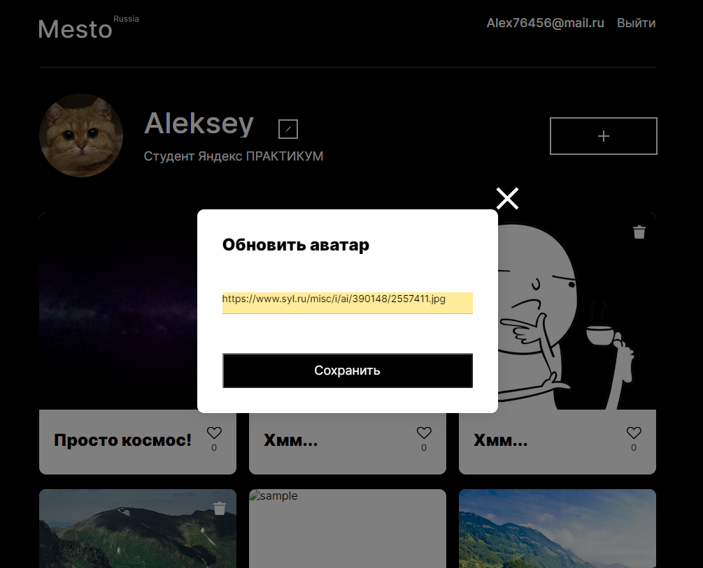

# Проект: Mesto-react-auth

### Mesto-react: это пректная работа 12 спринта в Яндекс Практикум на курсе "профессия Веб-разработчик".





### [Ссылка на проект](https://alex76456.github.io/react-mesto-auth/)

### Установка

Клонируйте себе в репозиторий, затем:

```
npm install

npm start
```

**Используемые технологии:**
* React
* flexbox;
* grid layout;
* font-face для подключения сторонних шрифтов;
* сглаживание шрифтов;
* javasript;
* относительные величины;
* медиазапросы для адаптации на разные экраны;
* относительное и абсолютное позиционировани;

**Функциональность:**
* Регистрация и авторизация пользователя
* Файловая структура проекта по правилам Nested БЭМ
* Grid Layout и Flex-вёрстка
* Адаптивность
* Все ссылки реагируют при наведении
* Лайк карточки
* Валидация всех форм
* Плавное открытие и закрытие попапов
* Редактирование аватара и информации о пользователе
* Возможность добавлять и удалять карточки. Удалять можно карточки созданные пользователем.


*Планы по доработке*:  
* 

Работа над проектом велась с использованием макета из графического редактора **_Figma_**.
